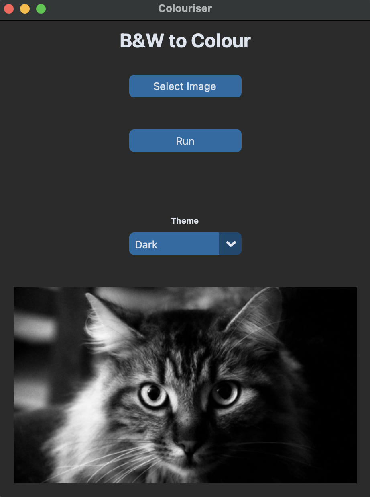

# CaffeGUI
A GUI that colourises B&amp;W images using the trained ‘caffe’ neural network model.

### Python TKinter GUI
Here, the program takes an image as an input and runs the colourisation model on the image.

Before                    |  After
:-------------------------:|:-------------------------:
 |  

[Required Model Download Link](https://drive.google.com/drive/folders/1FaDajjtAsntF_Sw5gqF0WyakviA5l8-a)
